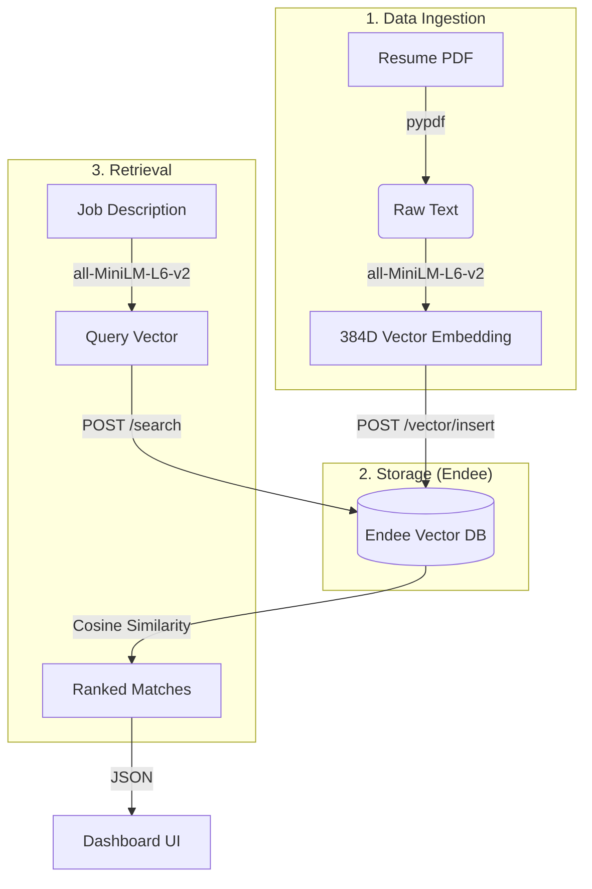

## � Project Overview & Problem Statement

### The Problem
Traditional resume screening relies on **keyword matching** (e.g., searching for "Python"). However, this often fails because:
- Candidates use synonyms or different phrasing (e.g., "Scripting Expert" vs "Python Developer").
- Recruiters have to manually read hundreds of PDFs to find "closeness" to a role.
- Standard databases aren't designed to measure "semantic meaning."

### The Solution
The **AI Resume Matcher** uses **Vector Embeddings** to translate human language into coordinates in a high-dimensional space. By using **Endee** as our high-performance vector database, we can instantly calculate the mathematical similarity between a job's requirements and a candidate's skills, ensuring the most qualified people are found instantly—even if they used different words.

---

## �️ System Design & Technical Approach

This project follows a modern **Vector Search Architecture**. We use a specialized AI model to process text and the Endee engine to handle the heavy mathematical lifting.



### 🗺️ How it Works (Architecture Flow)

```text
[Resume PDF] -> (pypdf) -> [Text] \
                                   -> (sentence-transformers) -> [Vector 384D] -> [Endee Vector DB]
                                                                                            |
[Job Description] -> (sentence-transformers) -> [Query Vector 384D] ----------------> (Match/Similarity Search)
                                                                                            |
                                                                                    [Ranked Resumes]
```

### Technical Stack:
- **Database:** Endee (High-performance C++ Vector DB)
- **Backend:** FastAPI (Python)
- **AI Model:** Sentence-Transformers (`all-MiniLM-L6-v2`)
- **Frontend:** Vanilla JS, CSS (Glassmorphism Dark Theme)

---

## 🏗️ How Endee is Used
To fulfill the core requirement, all vector storage and retrieval heavily relies on Endee's HTTP API. Inside [vector_store.py](vector_store.py), we integrate with these key endpoints:

**1. Storing Resumes:**
When a PDF is uploaded, we generate a vector and hit the Endee `insert` endpoint:  
`POST {ENDEE_API_URL}/index/{ENDEE_INDEX_NAME}/vector/insert`  
*Payload example:* `[{"id": "doc_1", "vector": [0.12, ...], "meta": "{\"filename\": \"...\"}"}]`

**2. Searching Candidates:**
When a Job Description is searched, we hit the Endee `search` endpoint:  
`POST {ENDEE_API_URL}/index/{ENDEE_INDEX_NAME}/search`  
*Payload example:* `{"vector": [0.12, ...], "k": 5}` *(Returns a msgpack binary response containing ranked matches).*

## 🚀 Quick Step-by-Step Guide to Run

Follow these simple steps from your terminal to run the software on your own computer:

### Step 1: Start the Database (Endee)
Open your terminal in the main `endee` repository folder and run:
```bash
docker compose up -d
```
*(This starts the Endee database silently in the background.)*

### Step 2: Start the Python App
Open a terminal inside the `resume-matcher` folder and run these commands to install dependencies and start the web server:
```bash
python -m venv venv
.\venv\Scripts\activate
pip install -r requirements.txt
uvicorn app:app --port 8000
```

### Step 3: Open the Dashboard!
Open your web browser and click this link:  
👉 **[http://localhost:8000/](http://localhost:8000/)**

You will see the shiny new user interface. You can drag and drop your PDFs inside, type a job requirement, and click search!

---

## 📸 Sample Output and Demo Video

Here is a video demonstration of the project in action:

<video src="assets/demo.mp4" width="100%" controls autoplay loop muted></video>

---

### Sample API Output (`/match` endpoint internally):
When the frontend searches for a candidate, the backend returns this clean JSON structure directly to the UI containing the matched Resumes ranked entirely by Semantic AI!

```json
{
  "job_description_snippet": "Looking for an experienced Python developer familiar with FastAPI...",
  "matches": [
    {
      "id": "c7de902d-c141-4762-8b6a-317f3faf0fc9",
      "similarity_score": 0.9818479623645544,
      "metadata": {
        "filename": "sample_resume.pdf",
        "text_snippet": "John Doe. Senior Python Engineer. Experience with FastAPI and Vector Databases like Endee...."
      }
    }
  ]
}
```
